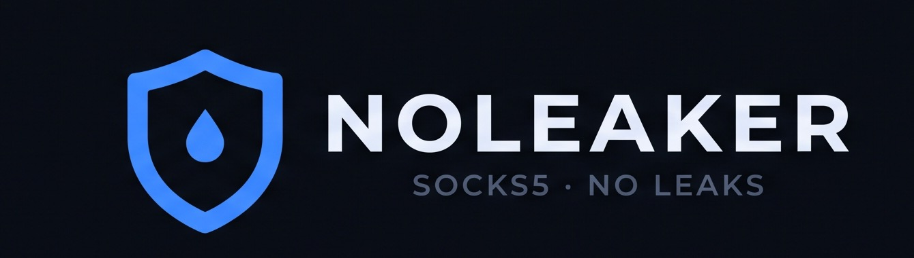
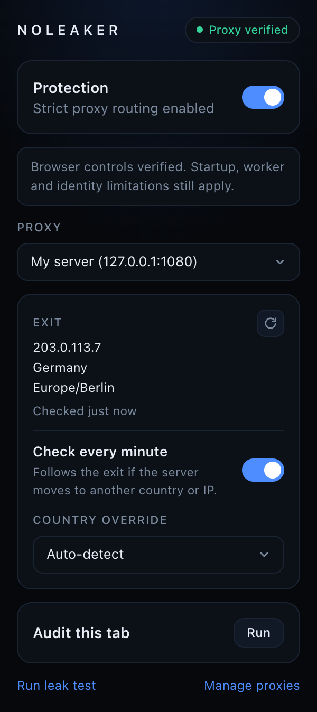
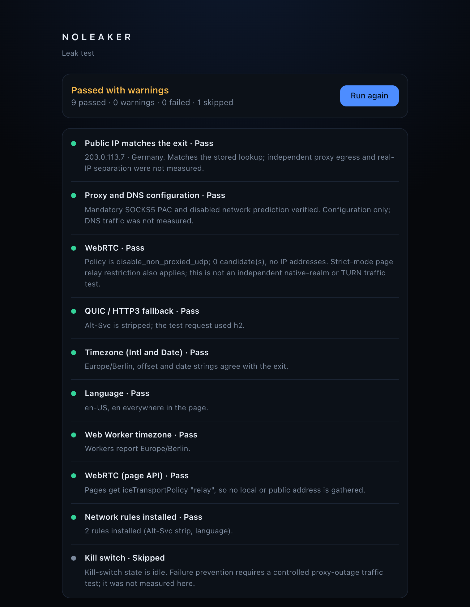
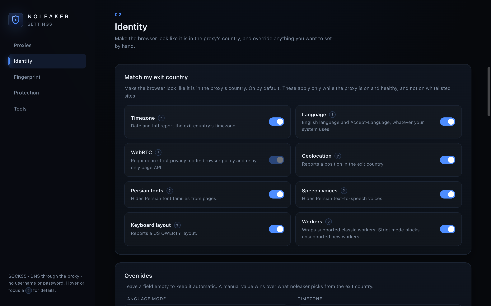

<p align="center"></p>

# noleaker: SOCKS5 proxy extension for Chrome with leak protection

[](https://github.com/LordVersA/noleaker/releases/latest)
[](https://github.com/LordVersA/noleaker/actions/workflows/release.yml)


[](LICENSE)

**noleaker** is a free, open-source Chrome extension (Manifest V3) that sends your browser through a
SOCKS5 proxy and stops the usual leaks: WebRTC, DNS, QUIC, timezone and language. Think of it as a
FoxyProxy alternative that also makes the browser look like it is in the proxy's country.

No account, no license key, no servers of our own.

<p align="center">
  
  &nbsp;&nbsp;
  
</p>

## What it does

| Leak                | How noleaker handles it                                           |
| ------------------- | ----------------------------------------------------------------- |
| **IP and DNS**      | All browser traffic and DNS lookups go through your SOCKS5 proxy. |
| **WebRTC**          | Limited to proxied UDP, so pages cannot read your real IP.        |
| **QUIC / HTTP3**    | Upgrades are prevented, so traffic stays on the proxy.            |
| **Timezone**        | `Date` and `Intl` report the timezone of the proxy's country.     |
| **Language**        | `navigator.language` and `Accept-Language` follow your choice.    |
| **Geolocation**     | Reports a point in the exit country, not your real position.      |
| **Proxy goes down** | Kill switch: requests are blocked instead of going out directly.  |

Also included:

- **Built-in leak test** that checks each item above and tells you which setting fixes a failure.
- **Audit this tab**: see what the current site really reads from your browser.
- **Per-site whitelist**, manual overrides (timezone, locale, coordinates) and settings import/export.
- **Optional fingerprint shields** (off by default): canvas, audio and layout noise, WebGL, screen, CPU.
- **Two privacy modes.** _Strict_ (default) sends everything through the proxy. _Compatibility_ lets
  Iran-hosted sites (bundled list of about 127,000 domains) and your own direct domains skip it.

<p align="center">
  
</p>

## Install

1. Download `noleaker-<version>.zip` from the
   [latest release](https://github.com/LordVersA/noleaker/releases/latest) and extract it.
2. Open `chrome://extensions` and enable **Developer mode**.
3. Click **Load unpacked** and choose the extracted folder.

Needs Chrome 120 or newer. Other Chromium browsers are untested.

## Use

1. Popup → **Manage proxies** → add your SOCKS5 host and port.
2. Back in the popup, switch **Protection** on. The pill shows **Proxy verified**.
3. Click **Run leak test** to check IP, DNS, WebRTC, QUIC, timezone and language.

## Troubleshooting

- **Everything is blocked, icon is red:** the proxy is unreachable. Start your SOCKS5 server; it
  recovers within a minute. Options → Diagnostics shows what happened.
- **"noleaker does not control the proxy":** another extension (for example FoxyProxy) or a policy
  owns Chrome's proxy settings. Disable it.
- **A site shows your real timezone:** check that the site is not whitelisted, then reload the page.
- **WebRTC calls do not work:** expected. Chrome cannot carry UDP through SOCKS5, so WebRTC is
  restricted to protect your IP.

## Limits

- **Not a VPN.** Only Chrome traffic is covered, and the proxy operator sees where it goes.
- **SOCKS5 without username/password only.** Chrome's proxy API cannot do more.
- **"Proxy verified" is not a guarantee of zero leaks.** It means the browser controls were applied
  and read back. Independent packet capture has not been done yet.
- **Not an anti-bot tool.** Spoofing removes obvious mismatches; it does not make you undetectable.
- Cookies and logins survive proxy changes. Use a separate browser profile to keep identities apart.

The full list of protections, edge cases and known gaps is in [docs/DETAILS.md](docs/DETAILS.md).
What the extension sends over the network is in [PRIVACY.md](PRIVACY.md).

## Build from source

```sh
npm install
npm run build     # typecheck + production build to dist/
npm run dev       # watch mode with source maps
npm test          # run after a build
npm run socks     # local SOCKS5 server on 127.0.0.1:1080 for testing
npm run package   # build and zip to release/
```

Load the `dist/` folder with **Load unpacked**. After a rebuild, reload the extension and your open
tabs. Testing, releases and design notes: [docs/DETAILS.md](docs/DETAILS.md) and
[DESIGN.md](DESIGN.md).

## License

[GPL-3.0](LICENSE). Third-party data, services and build tools are listed in
[THIRD_PARTY.md](THIRD_PARTY.md).
